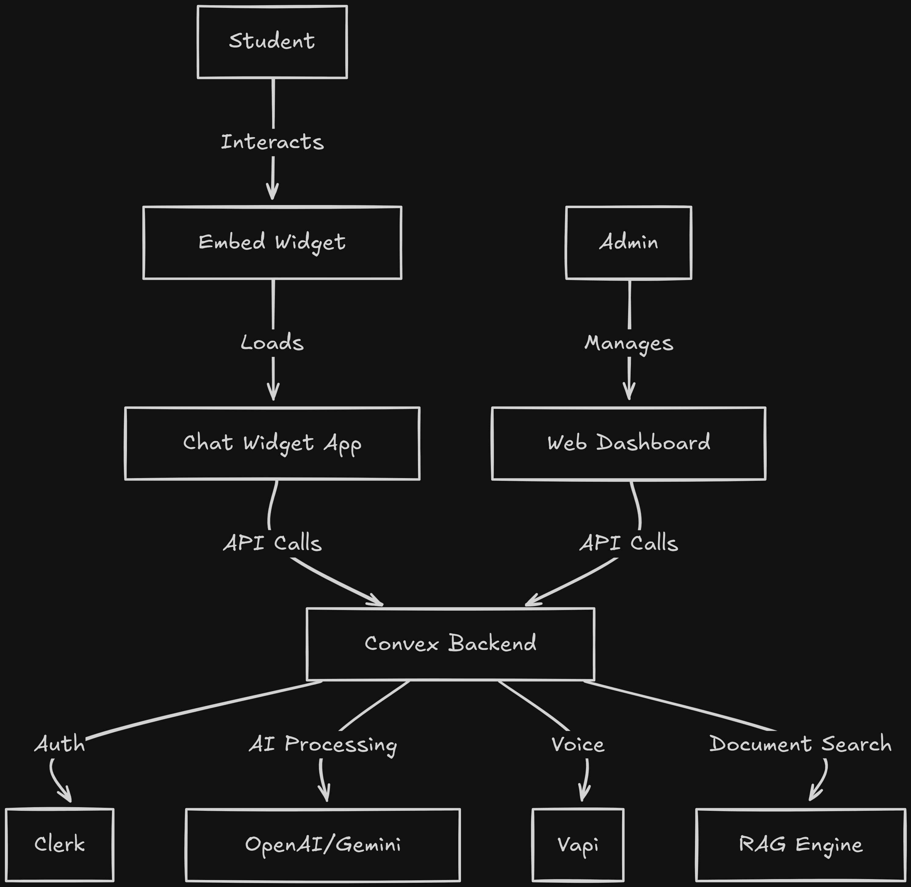

<div align="center">
  <h1>ASKLY</h1>
  <p><strong>Multilingual Conversational AI for Campus Communication</strong></p>
  
  [](https://www.gnu.org/licenses/gpl-3.0)
  [](https://nodejs.org/)
  [](https://pnpm.io/)
  [](https://www.typescriptlang.org/)
</div>

---

## Table of Contents

- [Overview](#-overview)
- [Problem & Solution](#-problem--solution)
- [Key Features](#-key-features)
- [Tech Stack](#-tech-stack)
- [Project Structure](#-project-structure)
- [Prerequisites](#-prerequisites)
- [Installation](#-installation)
- [Configuration](#-configuration)
- [Development](#-development)
- [Deployment](#-deployment)
- [Integration Guide](#-integration-guide)
- [Architecture](#-architecture)
- [Contributing](#-contributing)
- [License](#-license)

## Overview

Askly is an innovative **multilingual conversational AI platform** designed to transform campus communication by eliminating language barriers in Indian educational institutions. It provides **24/7 automated student support** in English, Hindi, and regional languages through both chat and voice interfaces.

### Core Capabilities

- **Multilingual Communication** – Support for English, Hindi & regional languages
- **Intelligent Query Processing** – AI-powered understanding with context management
- **Knowledge Integration** – RAG-powered responses from institutional documents
- **Voice Support** – Real-time voice calls via Vapi integration
- **Analytics Dashboard** – Real-time insights and conversation logs
- **Enterprise Security** – Encrypted communications with Clerk authentication
- **Easy Integration** – Embeddable widget with single script tag

## Problem & Solution

### The Problem

Campus offices across India handle **thousands of repetitive queries daily**:

- Students face **language barriers** (most systems only support English)
- Information exists in PDFs/circulars but lacks **accessibility**
- Results in **long queues, communication gaps, and overworked staff**

### Our Solution

Askly provides:

- **Instant answers** in native languages (Hindi, Tamil, Telugu, etc.)
- **Context-aware** conversations across multiple turns
- **Voice & text** interaction support
- **Smart escalation** to staff with full conversation history
- **70% reduction** in repetitive queries

---

## Key Features

### For Students

- **24/7 Instant Support** – Get answers anytime, anywhere
- **Multilingual Chat & Voice** – Communicate in your preferred language
- **Cross-Platform** – Web widget, WhatsApp, Telegram support
- **Context-Aware** – AI remembers conversation history

### For Administrators

- **Real-Time Dashboard** – Monitor conversations and analytics
- **Knowledge Base Management** – Upload and manage institutional documents
- **Smart Escalation** – Automatic handoff to staff for complex queries
- **Insights & Analytics** – Understand student needs and query patterns
- **Organization Management** – Multi-tenancy with Clerk

### Technical Features

- **Real-Time Communication** – Powered by Convex
- **Modern UI** – Next.js 15 + React 19 + Tailwind CSS
- **Easy Integration** – Single script tag deployment
- **Scalable Architecture** – Handles thousands of concurrent conversations
- **Type-Safe** – Full TypeScript implementation

---

## Tech Stack

### Frontend

- **Framework:** Next.js 15 (React 19)
- **Styling:** Tailwind CSS + shadcn/ui
- **State Management:** Jotai
- **Authentication:** Clerk
- **Forms:** React Hook Form + Zod

### Backend

- **Database:** Convex (real-time serverless)
- **AI/ML:** OpenAI, Google Gemini, Anthropic Claude
- **RAG:** Convex RAG for document retrieval
- **Voice:** Vapi (real-time voice calls)

### DevOps

- **Monorepo:** Turborepo
- **Package Manager:** pnpm
- **Language:** TypeScript 5.7
- **Linting:** ESLint + Prettier
- **Build Tool:** Vite (for embed), Next.js (for apps)

---

## Project Structure

```
askly/
├── apps/
│ ├── web/               # Main dashboard (Next.js)
│ │ ├── app/             # App router pages
│ │ ├── components/      # Shared components
│ │ └── modules/         # Feature modules
│ ├── widget/            # Chat widget interface
│ │ └── modules/         # Widget-specific modules
│ └── embed/             # Embeddable script (Vite)
│ ├── embed.ts           # Main embed logic
│ ├── config.ts          # Configuration
│ └── icons.ts           # SVG icons
├── packages/
│ ├── backend/           # Convex backend
│ │ └── convex/          # Database schema & functions
│ ├── ui/                # Shared UI components (shadcn)
│ ├── typescript-config/ # Shared TypeScript configs
│ └── eslint-config/     # Shared ESLint configs
├── package.json         # Root package.json
├── turbo.json           # Turborepo configuration
└── pnpm-workspace.yaml  # pnpm workspace config
```

## Prerequisites

Before you begin, ensure you have the following installed:

- **Node.js** ≥ 20.0.0
- **pnpm** 10.4.1 or higher
- **Git**

### Required Accounts

1. **Clerk** – [clerk.com](https://clerk.com) (Authentication)
2. **Convex** – [convex.dev](https://convex.dev) (Backend/Database)
3. **Vapi** – [vapi.ai](https://vapi.ai) (Voice integration)
4. **Gemini** – [aistudio.google.com](https://aistudio.google.com/) (AI models)

---

## 🚀 Installation

### 1. Clone the Repository

```bash
git clone https://github.com/senutpal/askly.git
cd askly
```

2. Install Dependencies

```bash
pnpm install
```

3. Set Up Convex Backend

```bash
cd packages/backend
pnpm run setup
# Follow the prompts to create a Convex project
```

This will:

- Create a new Convex project (or link to existing)
- Generate convex/.env.local with your deployment URL
- Set up the database schema

# Configuration

### Environment Variables

Create .env.local files in each app directory:

## apps/web/.env.local

```bash
# Clerk Authentication
NEXT_PUBLIC_CLERK_PUBLISHABLE_KEY=pk_test_xxxxx
CLERK_SECRET_KEY=sk_test_xxxxx

# Convex

NEXT_PUBLIC_CONVEX_URL=https://your-project.convex.cloud
CONVEX_DEPLOYMENT=your-deployment-name

# URLs
NEXT_PUBLIC_WIDGET_URL=http://localhost:3001
NEXT_PUBLIC_APP_URL=http://localhost:3000
```

## apps/widget/.env.local

```bash
# Convex
NEXT_PUBLIC_CONVEX_URL=https://your-project.convex.cloud

# Vapi Voice
NEXT_PUBLIC_VAPI_PUBLIC_KEY=your-vapi-public-key
VAPI_PRIVATE_KEY=your-vapi-private-key
```

## apps/embed/.env

```bash
## Widget URL (where the chat widget is hosted)
VITE_WIDGET_URL=http://localhost:3001
```

## packages/backend/convex/.env

```bash
## AI Providers
GOOGLE_GENERATIVE_AI_API_KEY=xxxxx

## Vapi Server
VAPI_API_KEY=xxxxx

## Clerk (for backend)
CLERK_SECRET_KEY=sk_test_xxxxx
```

## Clerk Setup

- Create a new Clerk application
- Enable the following social providers (optional):
  - Google
  - GitHub
- Configure allowed callback URLs:
  - http://localhost:3000
  - http://localhost:3001
- Enable Organizations feature in Clerk dashboard

# Development

Start All Services
From the root directory:

```
pnpm dev
```

This starts:

- Web Dashboard: http://localhost:3000
- Chat Widget: http://localhost:3001
- Embed Script: http://localhost:3002
- Convex Backend: Auto-syncs in dev mode

### Start Individual Apps

```bash
# Web dashboard only
cd apps/web && pnpm dev

# Widget only
cd apps/widget && pnpm dev

# Embed script only
cd apps/embed && pnpm dev

# Convex backend only
cd packages/backend && pnpm dev
```

### Build for Production

```bash
# Build all apps
pnpm build

# Build specific app
pnpm build --filter=web
pnpm build --filter=widget
pnpm build --filter=embed
```

### Linting & Formatting

```bash
# Lint all packages
pnpm lint

# Format code
pnpm format
```

# Deployment

## Deploying the Backend

```bash
cd packages/backend
pnpm run deploy
```

This deploys your Convex backend to production.

## Deploying the Web Apps

Recommended: Use Vercel for Next.js apps

### Deploy Web Dashboard

```bash
cd apps/web
vercel --prod
```

Configure environment variables in Vercel:

- Add all variables from apps/web/.env.local
- Update NEXT_PUBLIC_WIDGET_URL to production URL

### Deploy Widget

```bash
cd apps/widget
vercel --prod
```

### Deploy Embed Script

```bash
cd apps/embed
pnpm build
# Upload dist/widget.js to your CDN or static hosting
```

Or use Vercel:

```bash
cd apps/embed
vercel --prod
```

## Environment Variable Updates

After deployment, update:

1. Clerk allowed callback URLs with production domains
2. Convex deployment URL in all apps
3. VITE_WIDGET_URL in embed app to production widget URL

# Integration Guide

## Embed the Widget on Any Website

Add this single script tag to your HTML:

```bash
<script
  src="https://your-domain.com/widget.js"
  data-organization-id="org_xxxxxxxx"
  data-position="bottom-right"
></script>
```

## Programmatic Control

```bash
// Initialize or reinitialize
window.AsklyWidget.init({
  organizationId: 'org_xxxxxxxx',
  position: 'bottom-left' // or 'bottom-right'
});

// Show widget
window.AsklyWidget.show();

// Hide widget
window.AsklyWidget.hide();

// Destroy widget
window.AsklyWidget.destroy();
```

## Framework-Specific Examples

### React

```bash
import { useEffect } from 'react';

function App() {
  useEffect(() => {
    const script = document.createElement('script');
    script.src = 'https://your-domain.com/widget.js';
    script.setAttribute('data-organization-id', 'org_xxxxxxxx');
    document.body.appendChild(script);

    return () => {
      document.body.removeChild(script);
      window.AsklyWidget?.destroy();
    };
  }, []);

  return <div>Your App</div>;
}
```

### Next.js

```bash
# In _app.tsx or layout.tsx
import Script from 'next/script';

export default function Layout({ children }) {
  return (
    <>
      <Script
        src="https://your-domain.com/widget.js"
        data-organization-id="org_xxxxxxxx"
        strategy="lazyOnload"
      />
      {children}
    </>
  );
}
```

# Architecture
## High-Level Overview

## Data Flow
1. **User Interaction:** Student clicks embedded widget button
2. **Widget Load:** iframe loads chat interface from widget app
3. **Authentication:** Anonymous or authenticated via Clerk
4. **Message Processing:**
   - User sends message
   - Convex backend receives message
   - RAG searches knowledge base
   - AI generates contextualized response
5. **Response Delivery:** Message streamed back to widget
6. **Escalation:** Complex queries automatically escalated to staff
## Key Design Decisions
- Monorepo: Turborepo for efficient development and builds
- Real-Time: Convex for live updates and serverless functions
- Type-Safety: Full TypeScript for compile-time safety
- Component Library: shadcn/ui for consistent, accessible UI
- Multi-Tenancy: Clerk organizations for campus isolation
# License
This project is licensed under the GNU General Public License v3.0. See the LICENSE file for details.
